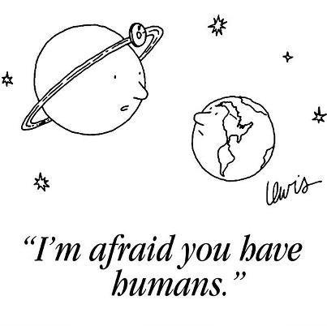

# ENSP 200, Class 3, Human Population

## New Yorker Cartoon

## Learning Objectives
- Understand the factors that affect human population

## Guiding Questions
- How many people can the world support?
- What tools do we have to change our population growth?

## World Population Growth

## World Population Growth

| Population | Year Reached     |
|------------|------------------|
| 1 billion  | 1800             |
| 2 billion  | 1930             |
| 3 billion  | 1960             |
| 4 billion  | 1974             |
| 5 billion  | 1987             |
| 6 billion  | 1999             |
| 7 billion  | 2011             |

## Population model

## Cultural carrying capacity
The maximum number of people that could live in reasonable comfort
indefinitely.

## Age structure
- It is useful to know the ages of a population
- We use a histogram for this

<!-- what is the age structure in this classroom? -->

## Age structure by country
Can you see the effects of life expectancy and birth rates?

## United States Baby Boom

## United States Baby Boom

## What factors determine population growth?

## Crude Birth Rate
Number of live births per 1000 people per year

## Crude Death Rate
Number of deaths per 1000 people per year

## Fertility Rate
Number of births per woman

## Rates
- Why rates instead of total number?
- Rates are per 1000 persons
- Rates make it easier to compare countries with different total
  populations

<!-- these rates are not constant over time -->

## Transition
- How do these rates change over time as a country develops?
- How does improved medical care and sanitation change rates?

## Demographic Transition
- As countries develop death rates fall
- Birth rates decline
- Population rises and falls

## Demographic Transition

